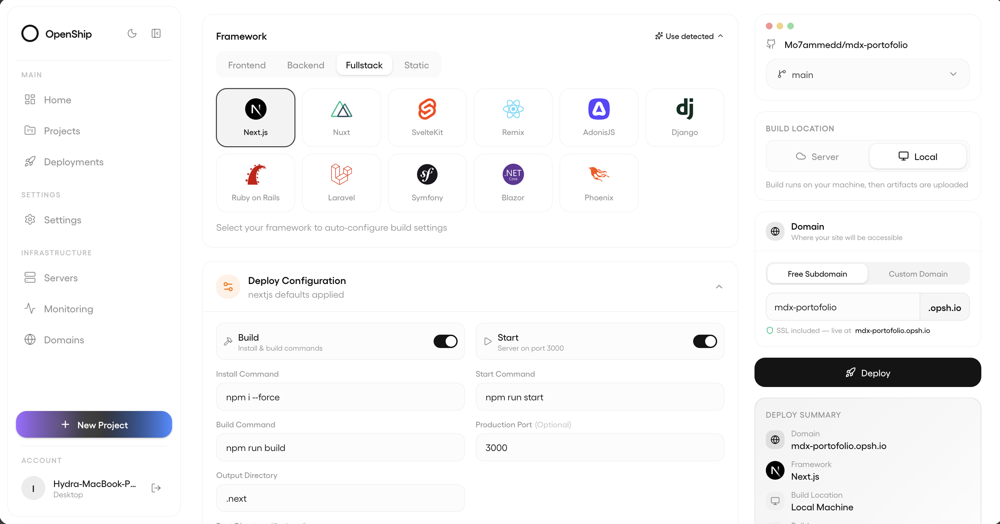

<h1 align="center">Openship</h1>

<p align="center">
  Deploy anything. Own everything.<br>
  Push your code — build, configure, and deploy from one place.<br>
  Use our cloud or connect your own servers.
</p>

<p align="center">
  Desktop-first. Open-source. Zero lock-in.
</p>

<p align="center">
  
</p>

---

## What Openship Is

Openship is a **desktop-first deployment platform with built-in CI/CD and full infrastructure control**.

It removes the gap between writing code and running it in production.

No pipelines to maintain.  
No YAML to manage.  
No platform lock-in.

---

## The Core Idea

Most platforms run everything on your server:

- CI/CD pipelines
- Build systems
- Dashboards
- Databases
- Your apps

→ Your production resources are shared with tooling.

---

### Openship

**Your machine**
- Desktop app (UI)
- Build system (local by default)
- Deployment control

**Your server**
- Production containers only

→ No resource contention  
→ Predictable performance  
→ Clean architecture  

---

## Desktop-First Architecture

Openship is not a hosted dashboard.

It’s a **local control plane for your infrastructure**.

- Builds run locally by default
- Deployments are triggered instantly
- Works with any VPS or private network
- No dependency on a remote control layer

Your server stays minimal:
- No CI runners
- No dashboards
- No management services

Only your apps.

---

## Built-in CI/CD (Without the Overhead)

CI/CD is fully integrated — without pipelines to configure.

- Deploy on every push
- Preview environments per branch
- Staging and production flows
- Rollbacks built-in

You can still use:
- CLI workflows
- External CI if needed
- Server-side builds (optional)

Default: simple, fast, local.

---

## Deploy Anywhere

- Openship Cloud (managed)
- Any VPS or bare metal
- Any provider, any region
- Multi-server deployments

Same app, same flow — everywhere.

---

## Full Backend Support

Run complete applications out of the box:

- Databases (Postgres, MySQL, MongoDB)
- Redis / caching
- Background workers
- WebSockets
- APIs
- Storage

Provision and manage everything from the app.

---

## Any Stack

If it builds, it ships.

- Node.js, Bun, Deno
- Python, Go, Rust
- PHP, Ruby, Java, .NET
- Docker (full control)
- Monorepos supported

No lock-in to a runtime.

---

## Domains & SSL

- Automatic SSL (Let's Encrypt)
- Wildcard domains
- Unlimited domains
- Auto-renewal

No manual setup.

---

## The Desktop App

Everything in one place:

- One-click deploys
- Live build logs
- Real-time metrics
- Domain & DNS management
- Database control
- Backups & restore
- Scaling controls

Replaces:
- CI dashboards
- SSH workflows
- Manual Docker setup

---

## Developer Interfaces

### CLI

```bash
openship deploy
openship logs --follow
openship rollback
openship domains
```

---

### REST API

Automate everything:

- Deployments
- Projects
- Domains
- Logs

---

### MCP (AI / Agent Control)

Expose deployment actions to external agents when needed.

---

## Backups

- Scheduled backups
- Databases + volumes
- One-click restore
- Export anytime

---

## Portability

Move anywhere:

- Cloud ↔ self-host
- VPS → VPS
- Full export/import

No proprietary formats:
- Standard Docker containers
- Encrypted transfer via SSH

---

## Built-in Mail Server

- Unlimited domains
- Standard email auth (DKIM, SPF, DMARC)
- No external providers required

---

## Global CDN

- Edge caching
- Compression (HTTP/3, Brotli)
- Instant cache purge

Works with any deployment.

---

## Scaling

### Cloud
- Auto-scaling
- Load balancing
- Zero config

### Self-hosted
- Upgrade servers anytime
- Move workloads without redeploy
- Multi-node ready

---

## Architecture Comparison

### Traditional Tools

Server runs:
- CI/CD
- Build system
- Dashboard
- Reverse proxy
- Apps

→ Resource contention  
→ Complex setup  

---

### Openship

**Local machine**
- Builds
- Control plane

**Server**
- Production containers only

→ Maximum efficiency  
→ Minimal overhead  

---

## Why Openship

- Desktop-first deployment loop
- Built-in CI/CD without pipeline overhead
- No YAML or infra complexity
- No server-side tooling overhead
- Works on any Linux server
- Fully open-source (AGPL-3)
- No vendor lock-in

---

## Example Flow

1. Connect your repo
2. Connect a server (or use cloud)
3. Click deploy

Under the hood:
- Build runs locally
- Production container is shipped
- App goes live

---

## Philosophy

Infrastructure should be:

- Local-first
- Transparent
- Portable
- Fully owned

Not hidden behind platforms.  
Not tied to pricing models.  
Not dependent on proprietary runtimes.

---

## Open Source

- AGPL-3 licensed
- Fully self-hostable
- No usage limits
- Community-driven

---

## Status

Production-ready core.

Planned:
- Multi-node clusters
- Load balancing UI
- Private networking
- Advanced monitoring
- Visual CI/CD pipelines

---

## Get Started

- Download the app
- Connect your repo
- Deploy in minutes

No lock-in.  
No complexity.  
Full control.

---

## License

AGPL-3