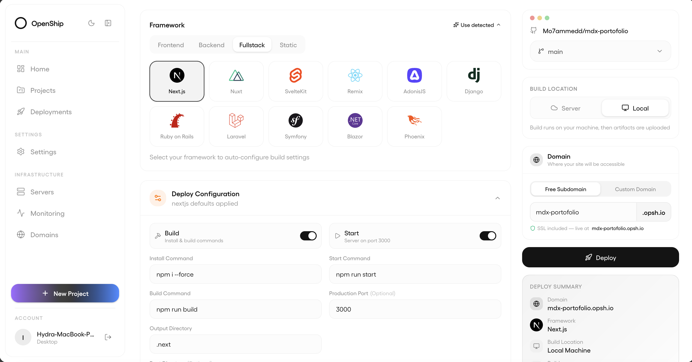

<h1 align="center">Openship</h1>

<p align="center" dir="rtl">پلتفرم متن‌باز و قابل میزبانی شخصی برای استقرار، با <strong><bdi dir="ltr">CI/CD</bdi></strong> داخلی.<br>یک مخزن به آن بدهید — اپ را می‌سازد، منتشر می‌کند، مسیر می‌دهد و <bdi dir="ltr">TLS</bdi> را تمام می‌کند. از اپ دسکتاپ، داشبورد وب یا <strong><bdi dir="ltr">CLI</bdi></strong> هدایتش کنید.</p>

<p align="center">
  <a href="https://www.npmjs.com/package/openship"></a>
  <a href="../../LICENSE"></a>
  <a href="https://openship.io"></a>
</p>

<p align="center">
  <a href="#شروع-سریع">شروع سریع</a> ·
  <a href="#چگونه-کار-می‌کند">چگونه کار می‌کند</a> ·
  <a href="#رابط‌ها">رابط‌ها</a> ·
  <a href="https://openship.io/docs">مستندات</a> ·
  <a href="../../CONTRIBUTING.md">مشارکت</a>
</p>

<p align="center">
  <a href="../../README.md"></a>
  <a href="README.ar.md"></a>
  <a href="README.fa.md"></a>
  <a href="README.zh.md"></a>
  <a href="README.es.md"></a>
  <a href="README.fr.md"></a>
  <a href="README.ja.md"></a>
  <a href="README.pt.md"></a>
  <a href="README.de.md"></a>
  <a href="README.tr.md"></a>
  <a href="README.ko.md"></a>
</p>

<p align="center">
  
</p>

---

<div dir="rtl">

## شروع سریع

اول یک تصمیم: **خود Openship را چگونه اجرا می‌کنید** (صفحهٔ کنترل). بقیهٔ کار بعد از آن یکسان است.

| اگر…                                                                  | Openship را اجرا کنید به‌صورت      | اپ‌های شما کجا اجرا می‌شوند                            |
| --------------------------------------------------------------------- | ---------------------------------- | ------------------------------------------------------ |
| **تنها هستید، یک ماشین، بدون ops**                                    | **اپ دسکتاپ**                      | سروری که با SSH وصل می‌کنید، یا Openship Cloud         |
| **تیم هستید — یا push-to-deploy / میزبانی روی باکس خودتان می‌خواهید** | **سرور خودمیزبان** (`openship up`) | روی همان باکس (حالت Compose) — یا به سرور دیگر / Cloud |
| **نمی‌خواهید چیزی اجرا کنید**                                         | **Openship Cloud**                 | سندباکس مدیریت‌شده، بدون راه‌اندازی                    |

> [!TIP]
> **تنها کار می‌کنید؟ اپ دسکتاپ را بگیرید.** صفحهٔ کنترل فقط وقتی اپ باز است روی ماشین شما اجرا می‌شود — چیزی روی سرور همیشه روشن باقی نمی‌ماند و چیزی عمومی نمی‌شود. نصب همیشه روشن وقتی لازم است که **push-to-deploy (CI/CD)**، **دسترسی تیمی**، یا **میزبانی اپ روی همان باکس** بخواهید.

### تنها — اپ دسکتاپ

صفحهٔ کنترل محلی است و سرورها را روی SSH می‌راند. بدون ورود، بدون ترمینال، بدون سطح عمومی — دانلود کنید، باز کنید، تمام:

| پلتفرم                    | دانلود                                                                                                       |
| ------------------------- | ------------------------------------------------------------------------------------------------------------ |
| **macOS** (Apple Silicon) | [Openship-arm64.dmg](https://github.com/oblien/openship/releases/latest/download/Openship-arm64.dmg)         |
| **macOS** (Intel)         | [Openship-x64.dmg](https://github.com/oblien/openship/releases/latest/download/Openship-x64.dmg)             |
| **Windows**               | [Openship-win32-x64.zip](https://github.com/oblien/openship/releases/latest/download/Openship-win32-x64.zip) |
| **Linux**                 | [Openship.AppImage](https://github.com/oblien/openship/releases/latest/download/Openship.AppImage)           |

لینوکس: `chmod +x Openship.AppImage && ./Openship.AppImage`. از قبل CLI دارید؟ `openship install` اپ را می‌گیرد و اجرا می‌کند.

### تیم / همیشه روشن — سرور خودمیزبان

CLI را نصب کنید (API + داشبورد را همراه دارد)، سپس **`openship`** را اجرا کنید — ویزارد تعاملی اولین مدیر را می‌سازد، دامنه را وصل می‌کند و Openship را به‌صورت سرویس بوت نصب می‌کند.

```bash
curl -fsSL https://get.openship.io | sh          # نصب  (یا: npm i -g openship — به Node 22+ نیاز دارد)
openship                                          # راه‌اندازی راهنمایی‌شده، سپس پنل کنترل
```

برای CI / باکس بدون تعامل، ویزارد را رد کنید و مستقیم `openship up` را برانید:

```bash
openship up                                       # نصب + شروع به‌صورت سرویس پس‌زمینه
openship up --public-url https://openship.example.com   # + داشبورد روی دامنهٔ شما (edge + TLS)
```

**یک پروژه را مستقر کنید:**

```bash
cd your-project
openship init            # این پوشه را به یک پروژه وصل می‌کند
openship deploy
```

راهنمای کامل سرور و مرجع CLI: **[openship.io/docs](https://openship.io/docs)**.

---

## چگونه کار می‌کند

Openship را به یک منبع اشاره دهید — مخزن GitHub، پوشهٔ محلی، یا آرتیفکت ازپیش‌ساخته — و یک خط لوله را تا انتها اجرا می‌کند:

1. **تشخیص.** `package.json`، کانفیگ فریم‌ورک، قفل وابستگی‌ها و هر `docker-compose.yml` / `openship.json` را می‌خواند.
2. **ساخت.** روی سرور مقصد یا محلی، به ایمیج Docker یا ریلیز bare.
3. **اجرا.** به‌صورت کانتینر (فقط روی loopback) یا فرایند نظارت‌شده روی میزبان.
4. **مسیریابی + امنیت.** لبهٔ OpenResty یک vhost می‌نویسد و گواهی Let's Encrypt صادر می‌کند. اختلال DNS یا گواهی استقرار را شکست نمی‌دهد.
5. **Push-to-deploy.** وب‌هوک GitHub خط لوله را روی هر push به شاخهٔ دنبال‌شده دوباره اجرا می‌کند.

---

## رابط‌ها

سه راه برای راندن همان بک‌اند:

- **اپ دسکتاپ** — GUI کامل، لاگ زنده. مناسب کار انفرادی.
- **داشبورد وب** — همان UI در مرورگر، برای تیم‌ها.
- **CLI** — قابل اسکریپت و مناسب CI؛ همچنین نصب نمونهٔ خودمیزبان.

یک نقطهٔ پایانی **MCP** (برای ایجنت‌های AI) و یک **REST API** هم برای اتوماسیون هست.

> [!NOTE]
> مستندات هنوز در حال تکمیل است. اگر چیزی کم یا مبهم است، [مشارکت](../../CONTRIBUTING.md) بسیار خوش‌آمد است.

---

## ویژگی‌ها

|                    |                                                                 |
| ------------------ | --------------------------------------------------------------- |
| **CI/CD داخلی**    | Push-to-deploy، محیط پیش‌نمایش، جریان staging/prod، بازگردانی   |
| **هر استک**        | Node، Python، Go، Rust، PHP، Ruby، Java، .NET، Docker، مونوریپو |
| **بک‌اند کامل**    | Postgres، MySQL، MongoDB، Redis، worker، WebSockets، ذخیره‌سازی |
| **دامنه و SSL**    | Let's Encrypt خودکار، wildcard، دامنهٔ نامحدود، تمدید خودکار    |
| **CDN**            | کش لبه، HTTP/3، فشرده‌سازی Brotli، پاک‌سازی آنی                 |
| **سرور ایمیل**     | SMTP داخلی با DKIM/SPF/DMARC — بدون Mailgun یا SES              |
| **پشتیبان**        | زمان‌بندی‌شده، پایگاه‌داده + volume، بازیابی یک‌کلیکی           |
| **نظارت زنده**     | لاگ ساخت، متریک کانتینر، جغرافیای بازدید                        |
| **مقیاس**          | مقیاس خودکار روی Cloud، آمادهٔ چندگره روی خودمیزبان             |
| **قابل حمل**       | کانتینر استاندارد Docker — جابه‌جایی آزاد بین ارائه‌دهنده‌ها    |
| **Docker Compose** | فایل‌های compose موجود را همان‌طور که هستند مستقر کنید          |

---

## وضعیت

هسته آمادهٔ production است و فعال توسعه داده می‌شود. خودمیزبانی **رایگان** است (بدون صورت‌حساب).

**بعدی:** خوشه‌های چندگره، UI توازن بار، شبکهٔ خصوصی، نظارت پیشرفته، و خط لولهٔ بصری CI/CD.

---

## مشارکت

[CONTRIBUTING.md](../../CONTRIBUTING.md) را ببینید.

---

## امنیت

آسیب‌پذیری پیدا کردید؟ لطفاً **خصوصی** گزارش دهید، هرگز در issue یا PR عمومی.

- **اینجا گزارش دهید (ترجیحی):** [گزارش آسیب‌پذیری](https://github.com/oblien/openship/security/advisories/new)
- دامنه و فرایند: [SECURITY.md](../../SECURITY.md).

---

## مجوز

Openship نرم‌افزار **متن‌باز** است، تحت [Apache License 2.0](../../LICENSE).

می‌توانید آن را اجرا، تغییر، خودمیزبان و توزیع کنید — از جمله در محصولات تجاری — طبق شرایط Apache 2.0. متن کامل در [LICENSE](../../LICENSE).

</div>
