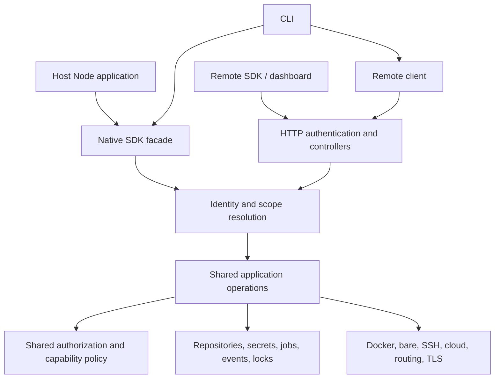

# Ship SDK and shared platform plan

Status: implementation in progress. Owned native deployments, broad shared platform operations, native CLI mode, and the public package assembly are implemented. Remaining feature coverage and CLI adoption, verified cloud tenant mapping, and distributed execution remain open. The supported API is documented in the website's [API → Node.js SDK guide](../apps/web/content/docs/api/sdk/index.mdx) and the [SDK README](../packages/sdk/README.md).

**Implementation checkpoint — September 13, 2026. The full plan remains in progress.**

The native facade and HTTP controllers now enter the same authorized operations for projects, sources, deployments, services/connections/storage, domains/DNS/TLS, credentials, server management, catalog apps, backups, jobs, analytics/issues, notifications, settings, audit, updates, incoming webhooks, tokens, permissions/invitations/memberships, GitHub/server Git configuration, notices, and billing. The coverage table below identifies remaining work within broad groups. Moving backend files is preservation work; a feature is SDK-supported only once contracts, policy, both adapters, and validation are wired.

- `packages/openship` owns the public npm name and assembles compiled ESM/CommonJS, declarations, the CLI, the Node worker, migrations, and runtime assets. Imports remain passive.
- Website SDK documentation now covers installation, native and remote/Cloud clients, verified user/namespace scopes, deployment workflows, and all current named operation groups. It is linked from the API navigation and overview. The public npm `openship@0.7.2` remains CLI-only; publishing an SDK-enabled version and deploying these website pages are separate release steps.
- Owned `createShip` accepts explicit storage, encryption, providers, and policy. It isolates the retained engine in an owned Node worker without starting an HTTP listener or making self-requests. Multiple tenant scopes share that installation; separate installations have isolated workers.
- Native identity assertions are verified by the host adapter. Durable issuer/subject mappings, namespaces, memberships, live grants, fixed tenant scopes, and separate instance/operator authority are enforced. Incoming hooks, invitations, and Git device continuations store constrained execution authority and recheck persisted revocation. Jobs, backup schedules, and scans still need equivalent principal migration.
- Native host execution and host Git credential discovery require explicit policy. Registered-server operations retain target authorization. Generated files and allowed directories enter the existing scan/build/deployment pipeline.
- Legacy CLI HTTP/SSE/folder-deployment implementations are removed. Native CLI mode exists. Most commands use named SDK operations; edge, mail, and parts of system management still need adoption.
- Public notices use a shared read operation. Installation notice management is a separate capability: `ship.operator.notices` for explicitly enabled native administration and `OpenshipOperatorClient` with an internal token remotely. An ordinary organization owner or instance-admin bearer token does not grant operator notice authority.
- Billing operations reuse the existing pricing, account state, subscription, checkout, top-up, portal and usage services. Stripe and Oblien signature ingress remains a transport boundary. Credit packs have one public shape; provider IDs and checkout/portal credentials are excluded from audit data. Hosted billing configuration and tenant mapping still determine availability.
- Fixed scopes reject legacy owner-account cloud forwarding with `CLOUD_SCOPE_UNAVAILABLE` until verified local/cloud tenant mapping exists. A remote client can address the canonical cloud organization directly.

The [migration audit](ship-sdk-migration-audit.md) records current relocation accounting and validation, separating earlier evidence from the current checkpoint. The latest full API run passed 5,859 tests with 3 skipped; full SDK, CLI and platform runs passed 147, 526 and 92 tests. Core, contract, database and adapter suites also passed. Recent checks cover Git source policy, continuation revocation, invitation transactions, billing parity, operator notices and native persistence. The built package passes installation checks on Node 22.21.1 and 24.21.0, including ESM/CommonJS, declarations and actual native deployments. Repeat affected gates after subsequent migration changes. A passing checkpoint is not completion of the remaining feature inventory.

A focused shared-core review corrected a deployment-preparation permission mismatch between HTTP and native calls while retaining the scanner and response projection. Its 693 affected API tests, 92 platform tests and real native-worker preparation/import check passed. The [review record](ship-sdk-migration-audit.md#focused-controllersdk-reuse-review) distinguishes these checks from the earlier full-suite totals.

**Remaining implementation work.** Finish organization/account lifecycle, remaining setup/self-app/edge/terminal operations, verified cloud mapping/linking/promotion, mail, migration/data transfer, and their CLI adoption. Complete constrained background principals, durable dispatch/idempotency/replay, distributed scheduler ownership, billing replay/accounting review, examples, compatibility checks, and final provider/package gates. Preserve the existing implementations and lift application policy out of transport adapters as each slice is completed.

The objective is to make Openship embeddable in Node applications. A developer should be able to create and manage projects, deploy generated code, manage infrastructure, and build a deployment product on top of the same application services that power the Openship HTTP API. The CLI, HTTP API, native SDK, and remote client should share contracts and behavior.

Native execution is a primary requirement. The SDK must invoke application operations directly when embedded; starting an HTTP server or making an HTTP request to itself is unnecessary. A remote client remains available for applications connecting to an existing Openship instance.

**One platform implementation will serve both native and HTTP callers.** The reusable unit is the complete application operation: input validation, authorization, tenant resolution, capability checks, orchestration, persistence, audit, and result presentation. Existing infrastructure adapters remain the implementations of Docker, bare processes, SSH, cloud resources, routing, and TLS.

The native SDK is a public facade over this shared platform. The HTTP controllers are another facade over it. Publishing a second copy of the business logic or exposing existing controller functions would not establish that shared boundary.



Native execution invokes the shared engine locally through an owned Node worker, or attaches to a caller-owned platform. The owned worker isolates the retained engine's process-level state without starting an HTTP listener or making self-requests. External work still uses the appropriate protocols: SSH to a server, provider APIs for cloud infrastructure, object storage requests, and Git operations. A project whose canonical control plane is another Openship instance may also require an explicit remote operation. These boundaries must be visible in configuration and capability discovery.

**The existing code provides substantial foundations, with specific extraction work remaining.**

| Existing component | What it provides | Required change |
| --- | --- | --- |
| [CLI package](../apps/cli/package.json) | Private command implementation, assembled by `packages/openship`. | Complete the remaining named SDK resource adoption; native CLI mode is implemented. |
| [Core package](../packages/core/src/index.ts) | Domain definitions, stack detection/configuration primitives, resource rules, shared utilities. | Keep the foundation small; reconcile public domain definitions as operations move. |
| [Adapters](../packages/adapters/src/platform.ts) | Runtime, SSH, cloud, routing, TLS, and system implementations. | Reuse them; make configuration and resource ownership suitable for multiple platform instances. |
| [Deployment services](../packages/platform/src/engine/modules/deployments/build.service.ts) and [pipeline](../packages/platform/src/engine/modules/deployments/build-pipeline.ts) | Configuration snapshots, preflight, builds, deployment lifecycle, and orchestration. | Shared deployment operations now enforce policy and call these retained services. Durable dispatch and recovery still need completion. |
| [Request context](../apps/api/src/lib/request-context.ts) | Identity, organization, credential scope, and request provenance. | HTTP adapts to the implemented transport-independent execution context; remaining controllers must adopt it. |
| [Permission resolver](../apps/api/src/lib/permission.ts) | Resource-to-organization resolution, membership and grant checks. | The shared authorizer returns an authorized context; HTTP applies that context at its adapter boundary. |
| [Instance administration](../apps/api/src/middleware/instance-admin.ts) | Separates instance administration from organization ownership. | Shared operations enforce separate instance authority; finish adoption for the remaining system features. |
| [Database client](../packages/db/src/client.ts) and [repository factories](../packages/db/src/repos/index.ts) | PostgreSQL/PGlite support, migrations, repository construction, locks. | Factories exist. Retained singletons are isolated inside each owned worker, preserving services without process-global host configuration changes. |
| [Application bootstrap](../apps/api/src/app.ts) | Platform initialization, route mounting, recovery, schedulers, workers. | Native lifecycle is separate; remaining schedulers and host lifecycle delegates need completion. |
| [Cloud routing](../apps/api/src/lib/cloud/project-router.ts) | Local versus cloud authority and forwarding. | Extract resource authority resolution and typed forwarding from Hono request handling. |
| [CLI SDK integration](../apps/cli/src/lib/ship-client.ts) | HTTP transport, pagination, uploads, streaming. | Transport/source workflows are shared; finish named methods for edge/mail/system commands. |

The root and CLI workspaces are now private; the release workflow assembles and publishes `packages/openship`. Private workspace packages expose TypeScript to workspace consumers; public exports contain compiled JavaScript and bundled declarations.

**Package boundaries will make the shared implementation explicit.**

| Location | Workspace name | Responsibility |
| --- | --- | --- |
| `packages/core` | `@repo/core` | Domain values, pure rules, configuration primitives, and small shared provider contracts where needed. |
| `packages/contracts` | `@repo/contracts` | Public operation inputs, results, errors, event types, and shared validation schemas. |
| `packages/platform` | `@repo/platform` | Authorized application operations, orchestration, identity/scope resolution, feature composition, and lifecycle. |
| `packages/db` | `@repo/db` | Persistence implementations, migrations, repositories, and database locking. |
| `packages/adapters` | `@repo/adapters` | Infrastructure and external-provider implementations. |
| `packages/sdk` | `@repo/sdk` | Native factory, scoped resource facade, remote client, and client-side source helpers. |
| `packages/openship` | `openship` | Published package assembly, exports, declarations, CLI executable, and required assets. |
| `apps/api` | `@repo/api` | HTTP server composition, authentication protocols, routing, request/response adaptation. |
| `apps/cli` | `@repo/cli`, private | Commands, prompts, context files, terminal output, and installation management. |

Mark the workspace root private and give it an internal name. Only the distribution package owns the public npm name. Application developers import `openship`; workspace applications import the appropriate internal SDK/platform entry.

Dependency rules:

- Core does not depend on the platform, SDK, database, or applications.
- Contracts may use core domain definitions; they do not import database rows, HTTP controllers, or runtime initialization.
- Database and infrastructure packages do not import the SDK or HTTP application.
- Platform operations consume repositories and providers through explicit dependencies. Provider contracts shared with lower packages must live below the platform or be adapted in the composition layer.
- SDK native composition constructs the platform with the selected dependencies. The remote client entry depends only on client code and contracts.
- Platform cloud forwarding uses an injected gateway contract. It must not import the SDK root and create a `platform -> sdk -> platform` cycle.
- Published-package build scripts may assemble compiled CLI/server artifacts. Runtime platform code must not import `apps/api` or `apps/cli`.

The existing adapter `Platform` describes runtime/routing/TLS composition. Use a distinct name such as `PlatformKernel` for the application layer so those two concepts do not become confused.

**Public imports will expose stable factories and resource interfaces.** The native implementation includes the application functionality needed to run Openship operations. Loading the module should only load definitions; initialization and work happen through explicit calls.

| Entry | Proposed surface | Loading behavior |
| --- | --- | --- |
| `openship` | `createShip`, `OpenshipClient`, public types and errors. | Passive import; native dependencies can load when `createShip` is called. |
| `openship/native` | Native factory and supported provider/configuration interfaces. | Explicit native integration entry. |
| `openship/client` | Remote HTTP client and public contracts. | Independent entry without database, Docker, SSH, or server bootstrap imports. |
| `openship` executable | Existing CLI commands. | Executed only through the binary entry. |

Internal repositories, raw permission overrides, migration handover flags, and private build snapshot arguments remain implementation details. Full platform functionality is exposed through authorized operations, rather than arbitrary access to every internal function.

The facade should present resource groups such as `projects`, `deployments`, `services`, `domains`, `servers`, `backups`, and `system`. Native and remote scoped clients implement the same resource contract for equivalent operations. Transport-specific mechanics, such as directory upload, remain explicit helper implementations.

**A native integration initializes one platform and creates scoped views for its users.** This example uses the implemented factory. `appAuth.verify` is supplied by the host and verifies a session before returning its external user ID. Trusted onboarding has already called `operator.ensureIdentity` and established membership.

```ts
import { createShip, type OwnedShip } from "openship/native";

let ship: OwnedShip<string>;
ship = await createShip({
  instanceId: "customer-deployments",
  stateDirectory: "/srv/my-product/openship",
  storage: { driver: "postgres", url: process.env.SHIP_DATABASE_URL!, migrations: "verify" },
  encryptionKey: process.env.SHIP_ENCRYPTION_KEY!,
  runtime: "bare",
  routing: "none",
  administration: true,
  policy: { sourceRoots: ["/srv/my-product/generated"] },
  identity: {
    async resolve(assertion: string) {
      const session = await appAuth.verify(assertion);
      if (!session) return null;
      const mapped = await ship.operator!.resolveIdentity({ issuer: "my-application", subject: session.userId });
      return mapped ? { user: mapped.user, sessionId: session.id } : null;
    },
  },
});
await ship.start();

try {
  const customer = await ship.scope({ identity: authenticatedSessionAssertion, organizationId: "org_customer_123" });
  const submitted = await customer.deploy({
    projectId: "proj_123",
    source: { type: "directory", path: "/srv/my-product/generated/app" },
    serverId: "srv_123",
  });
  const outcome = await customer.deployment(submitted.deployment_id).wait({ timeoutMs: 15 * 60_000 });
  console.log(outcome.status);
} finally {
  await ship.close({ mode: "drain" });
}
```

An application normally creates `ship` once, obtains a scoped view per authenticated request, and closes the platform during shutdown. Views share the owned worker and its connection pools. The factory isolates existing engine singletons in that worker rather than rewriting every service. It never changes the embedding application's environment or starts an HTTP listener.

The encryption key is a persistent UTF-8 secret of 32–4096 bytes. The factory requires explicit storage and binds the database to the installation/key; it never generates a replacement secret or chooses an existing CLI database. Local host execution is denied by default; the example targets an authorized registered server. Enable `policy.allowHostExecution` explicitly for local builds or managed local routing.

A remote integration uses the same resource operations through an existing server:

```ts
import { OpenshipClient } from "openship/client";

const customer = new OpenshipClient({
  baseUrl: "https://ship.example.com",
  token: process.env.OPENSHIP_TOKEN!,
  organizationId: "org_customer_123",
});
const submitted = await customer.deployments.create({ projectId: "proj_123", branch: "main" });
const outcome = await customer.deployment(submitted.deployment_id).wait({ timeoutMs: 15 * 60_000 });
```

A remote client never sends a fabricated native execution context to the server. The receiving server authenticates its credential and constructs its own authorized context.

**Virtual context means request-independent execution context.** The host application requests an identity and scope; the platform verifies the identity, resolves its mappings, and applies the same authorization policy used for HTTP requests. An object containing a chosen `userId`, `organizationId`, or `role: "owner"` does not grant authority by itself.

| Concept | Meaning and authority |
| --- | --- |
| Installation/platform instance | Owns configuration, state, providers, encryption, and the operator boundary. |
| Organization/tenant | Existing durable resource ownership and authorization boundary. Keep `organizationId` as the canonical internal identifier. |
| User/principal | The authenticated actor. A user can belong to several organizations. Credential restrictions can narrow that user's authority. |
| Project | Belongs to an organization. Access comes from membership and resource grants, not a caller-provided owner label. |
| Project group | Existing application/environment grouping. Preserve its current semantics. |
| Logical namespace | Optional organization-local grouping or scope. Define its policy explicitly before exposing it as a security boundary. |
| Provider namespace/workspace | Infrastructure isolation/accounting identity, such as the organization's Oblien namespace or a cloud workspace. Derive or map it from authorized durable ownership. |
| Instance administrator | Separate authority for whole-instance operations. Organization ownership does not imply instance administration. |

Context creation and use:

1. Authenticate a session/token, or ask the configured trusted host identity adapter to verify an assertion.
2. Map the external identity using a stable issuer/subject pair. Do not equate accounts solely by caller-supplied email or display name.
3. Resolve the requested organization from persisted membership and any credential binding.
4. Apply credential restrictions, including read-only access, token grants, expiry, and revocation.
5. Construct an immutable, platform-owned context with principal identity, validated scope, credential/policy references, source attribution, and trace metadata.
6. At operation time, resolve each resource's canonical owner and check access again. A long-lived scoped view must not freeze permissions indefinitely.
7. Return a derived authorized context when resource scope resolution is needed. Never mutate another caller's view or ambient organization state.
8. Record both the real actor and effective tenant in audit events, including any authorized delegation.

Public operation methods accept a scoped handle. Raw context construction and role overrides stay inside trusted integration code. TypeScript branding can prevent accidental misuse, but the package is not a sandbox against malicious code already executing in the same process with access to its database and credentials.

The current internal `buildBackgroundContext` helper defaults to an owner role; its old Hono dependency has been removed. It is an internal convenience, not a safe public context factory. Replace background execution with explicit system/delegated principals and resource-limited jobs as part of extraction.

**Tenant scoping needs explicit behavior for every entry point.** Lists and creates use the selected organization; detail operations resolve the actual owner of the resource. Credential bindings and explicitly fixed scopes constrain both. A caller scoped to customer A must not operate on customer B's project by changing an ID, even if the host application's operator has access to both.

Current HTTP behavior can derive a different organization from a resource and rebind the Hono context. Inventory this behavior before changing it. Adopt fixed tenant views consistently for the new native and remote scoped interfaces; any retained HTTP compatibility behavior must be explicit, independently authorized, and covered by tests. Do not hide a policy change inside a file move.

Existing patterns can support the main embedding models:

- One organization per customer: a stable external customer mapping selects the organization; every operation stays within it.
- One personal organization per user: personal project spaces use the existing organization/membership model.
- Several users in one customer organization: restricted roles and project grants provide project-level access. Ordinary membership may be broader, so use the appropriate policy deliberately.
- Automated project creation: reuse the create-and-grant semantics of scoped tokens, and extend them deliberately for verified native principals. Project creation and the associated access grant must have defined transactional behavior.
- Namespace-oriented products: first map external namespace keys to an existing tenant or appropriate grouping. If nested namespace isolation is required, add a tenant-owned namespace model, grant semantics, scoped queries, and migrations. A string prefix or renamed project group is insufficient.

Providing access to another user, creating tenants, synchronizing memberships, and minting delegated credentials are management operations. They require an authorized manager/operator scope. Runtime application code can call them after its own authentication, but request bodies cannot assign their own authority. Expose these operations through the same policy boundary as HTTP administration.

**Every public operation will enforce its own application policy.** HTTP middleware remains responsible for HTTP-specific authentication mechanics, origins, cookies, signatures, and network admission. Native invocation must retain application-level checks that currently happen only in routes or controllers.

The shared operation sequence is:

1. Validate input using the shared runtime schema, including allowed fields and size limits.
2. Resolve identity, resource ownership, and the effective immutable scope.
3. Enforce role/grant policy, repository-source access, credential restrictions, and instance-admin requirements where applicable.
4. Resolve operation capabilities, target access, quotas, and relevant operation admission limits.
5. Acquire existing transaction/lock boundaries and execute the shared orchestration.
6. Emit audit and lifecycle events with actor and tenant provenance.
7. Present a stable public result, masking protected values unless a specific reveal operation is authorized.

Keep operation metadata close to the operation: input/result schema, resource/action, scope rule, capability requirement, and audit behavior. HTTP route definitions can reference that metadata. Extend the existing route registration approach rather than maintaining independent HTTP and SDK permission tables.

Internal lower-level functions can assume an already-authorized operation context, but they are not public SDK exports. Internal rollback snapshots, migration handover images, and trigger provenance remain separate from public inputs.

Audit must move with the operation. Remove duplicate controller emissions as each operation migrates, and preserve the current distinction between awaited and asynchronous audit writes. Native calls must retain attribution even without an IP address or HTTP user agent.

**Platform state will belong to a constructed instance.** One process may host many scoped users on one platform, or multiple platforms with different databases and providers. Neither arrangement may depend on changing `process.env` between calls.

| Dependency | Required instance behavior |
| --- | --- |
| Configuration | Validated immutable configuration; the API/CLI can translate environment variables at their composition boundaries. |
| Database/repositories | Explicit connection, transaction, schema, and resource ownership; reuse existing repository factories. |
| Identity and memberships | Trusted identity verification plus authoritative mappings, membership, and credential stores. |
| Authorization | Shared policy with fresh revocation/grant checks; no global active user or organization. |
| Secrets | Instance-owned key provider and credential resolver; tenant/provider scoping where required. |
| Runtime/provider factory | Selects targets from authorized project/server bindings and supplied provider configuration. |
| SSH and Docker connections | Explicit pools, lifecycle, and tenant/target-aware lookup. |
| Locks | Preserve project/runtime/host-port/provisioning locks and PostgreSQL advisory lock behavior. |
| Events and prompts | Instance-owned event service, bounded replay, subscriptions, cancellation, and prompt resolution. |
| Job runner and scheduler | Explicit backend and worker ownership; start only when configured. |
| Caches | Include instance and relevant tenant/provider identity in keys; share only when intentionally configured. |
| Cloud gateway | Typed upstream operations with account mapping, delegated credentials, timeouts, and authority checks. |
| Logging/clock/IDs | Injectable interfaces where useful; structured diagnostics without terminal UI dependencies. |

Important global extraction sites include the database client/repository singleton, adapter platform singleton, job runner, Redis/cache stores, SSH manager, build session manager, cloud client/token caches, settings/configuration, and encryption helpers. Audit other feature modules for timers, clients, and mutable module state before claiming multiple-instance support.

**Startup, storage, and shutdown are part of the native contract.**

- Import: exports definitions; does not open a database, bind ports, install software, start timers, or alter process signal handlers.
- `createShip(config)`: validates configuration and prepares the platform's owned dependencies. Any initialization failures release partially opened resources.
- `start()`: opens the configured execution lifecycle, performs the selected initialization/recovery policy, and starts explicitly selected workers/schedulers.
- `scope(...)`: returns an immutable scoped resource view, without starting another platform.
- `close({ mode: "drain" })`: stops accepting work, drains owned execution, flushes required state, and releases owned handles. Closing the SDK does not remove deployed applications.
- External database pools, executors, and event buses retain caller ownership unless explicitly transferred to the SDK.

Support PGlite for a single process with its own configured data directory, and PostgreSQL for shared state and production concurrency. Retain embedded database locking and migration compatibility. Several organizations can share one embedded platform, but PGlite does not become a multi-process database.

Migration behavior must be explicit. An owned new embedded database can be initialized under the selected migration policy; attaching to an existing external database must verify compatibility and apply migrations only when the caller configured that behavior. Ship the necessary SQL, WASM, catalogs, Lua, and other native assets with reliable runtime resolution.

Existing encrypted data must remain readable. Extract key configuration while preserving the legacy key derivation/format for existing installations. Key changes or rotations need a deliberate migration path, including the existing transfer/export secret handling.

The SDK must not inherit or adopt an unrelated `~/.openship` installation implicitly. Storage directory and stable instance identity should be explicit or derived from a clearly documented application-specific configuration.

**Execution durability must match the selected worker model.** Embedded execution requires the host process to stay alive until its work completes or reaches a supported handoff. A remote client can exit after submission because the remote instance owns execution.

Separate deployment kickoff from the generic job runner during the inventory: an existing scheduler abstraction does not by itself make in-process deployment execution durable. Preserve current interruption detection and reconciliation, and implement durable deployment dispatch/leases before advertising detached execution across process restarts or replicas.

Queued work stores operation identity, instance/tenant/resource IDs, original actor, credential/policy references, trace information, and the immutable deployment configuration. It does not store a Hono context or plaintext bearer credential. Workers reconstruct an authorized context, revalidate at dispatch and relevant privileged stages, and retain the original actor in audit history. Recovery uses an explicitly scoped system principal.

Shared deployments and workers require shared locks, queues, events or replay storage, and duplicate-execution protection. Hosted/multiple-replica configurations must not silently fall back to process-local coordination. A detach shutdown mode is available only when a durable external worker has accepted ownership.

**Cloud and self-hosting use the same operation layer with different configured capabilities.** Keep these independent dimensions separate:

| Dimension | Examples | Responsibility |
| --- | --- | --- |
| Invocation | Native, remote HTTP | How the caller reaches an application operation. |
| Platform product mode | Embedded/self-hosted, hosted service | Which providers and operational policies are configured. |
| Tenant model | Personal, team, many customer organizations | Identity, ownership, grants, accounting. |
| Deployment target | Registered server, permitted local host, cloud workspace | Where the workload runs. |
| Build placement | Orchestrator, target server, isolated cloud builder | Where source/build commands execute. |
| Resource authority | Local platform, linked cloud control plane | Which platform owns the canonical project/state. |

A native SDK may manage a self-hosted server, run on a self-hosted server, or orchestrate a cloud workload. Multi-tenancy is not restricted to the cloud product mode. Native invocation also does not automatically authorize execution on the embedding application's host.

Expose capability discovery with reasons for unavailable operations. Requirements include the feature implementation, provider configuration, platform mode, target support, and caller authorization. An unavailable operation returns a typed error before committing resources. Feature selection must never bypass authorization or required accounting.

Preserve the existing cloud project authority and promotion/transfer semantics. Extract cloud routing from HTTP headers into explicit resource resolution. Local and cloud organization IDs can differ; use the stored account mapping rather than forwarding a local organization ID as remote authority. Existing org-owner cloud delegation must remain preceded by the caller's local authorization and followed by upstream authorization. Where precise delegation is possible, retain the narrowed scope and original actor.

Cloud master credentials belong to trusted provider configuration. Tenant operations receive scoped credentials or invoke an authorized gateway. Disabling local commercial billing in a self-hosted product does not disable the cloud provider's own quotas or charges.

**Generated application code is a workload, and its execution boundary must remain explicit.** Use the same source, build, deployment, and runtime pipeline for AI-generated projects as for ordinary projects. An AI tool can receive a scoped client for its allowed organization/projects without receiving database credentials or instance-administrator functions.

Enforce allowed targets, build time, CPU/memory/disk limits, concurrency, secret access, network policy where supported, and cleanup through the configured platform/runtime policy. Preserve the cloud adapter's explicit host-build restriction. A hosted multi-tenant process must not run an uploaded build command on its own host because the caller used the native SDK.

For workloads from untrusted customers, use the isolation guarantees of the selected runtime/provider and exclude privileged host access unless explicitly granted by operator policy. Context isolation protects control-plane operations; it does not isolate arbitrary JavaScript executed inside the SDK host process.

**Deployment workflows will converge on one shared source-to-deployment operation.**

| Source | Shared behavior | Interface-specific preparation |
| --- | --- | --- |
| Existing project source | Resolve saved source/configuration, authorize access, create a snapshot, execute. | Native and HTTP pass the same operation input. |
| Git repository | Repository access checks, detection, commit selection, cloning, build, deploy. | Authentication protocol can differ; source access policy stays shared. |
| Directory/generated files | Register an owned source, detect configuration, ensure project state, snapshot, build/deploy. | Native stages or snapshots allowed local files; remote client packages and uploads them. |
| Prebuilt image/release | Resolve immutable image/release identity, registry access, deployment settings. | Provider transfer/pull as required by the selected target. |
| Compose/monorepo | Persist and resolve services, dependency order, service selection, partial outcomes. | Preserve source-session and service metadata through either entry. |

A source resolver should produce a common owned source reference. Once registered, both native directories and uploaded archives enter the same detection/configuration/pipeline path. Queueing a deployment must not leave it reading an arbitrary mutable caller directory later; capture the source or establish an explicit managed-source lifetime.

The existing remote directory sequence remains useful:

1. Create an upload session.
2. Package and upload source.
3. Detect configuration on the authoritative side.
4. Create/update the project and service configuration.
5. Start a deployment from the owned source reference.
6. Observe its durable outcome.

Extraction requirements:

- Use portable asynchronous archive creation and bounded streaming uploads; avoid synchronous system `tar` and whole-archive buffering.
- Define inclusion/exclusion and secret-file behavior. Preserve build output needed for prebuilt/static deployments.
- Constrain native paths and archive extraction to allowed roots; validate path traversal and symlink behavior consistently.
- Keep server-side paths distinct from paths on a remote SDK caller's machine.
- Preserve upload-session IDs, detected services, advanced service settings, selected service IDs, diagnostics, and server-owned secret resolution. Masked values from a scan must not become literal deployed secrets.
- Follow server-provided upload targets and their credentials. Openship API tokens stay scoped to the Openship instance.
- Clean temporary artifacts after completion, failure, or cancellation; define expiry and ownership for registered sources.
- Return the failed stage and any created source/project/deployment IDs so recovery is possible without deleting unrelated state.
- Retain target validation, capacity checks, locking, port ownership, readiness, routing/TLS behavior, artifact retention, and rollback decisions.

**Events, outcomes, and decisions will have transport-independent contracts.** Native subscriptions consume typed events directly. HTTP encodes those events for SSE or another explicit transport. The remote SDK decodes them into the same public event types.

- Provide deployment handles with IDs and operations such as `get()`, `events()`, `wait()`, and `cancel()`.
- `deploy()` returns after the operation has submitted/registered the deployment. It does not imply that the application is ready.
- `wait()` uses persisted deployment state as the outcome authority; stream closure alone is insufficient.
- Retain `partial_failure`, `action_required`, `no_changes`, `rejected`, `reconciling`, and cancellation-pending semantics.
- Distinguish a live prompt awaiting input from a terminal deployment whose stored status is `action_required`.
- Expose pending prompts with IDs, allowed actions, deadlines, and explicit respond operations. Default automation reports that input is required; it does not silently approve host changes or accept a partial release.
- Keep keep/reject, rollback planning, and cancellation acknowledgment explicit.
- An aborted local wait or disconnected subscriber does not automatically cancel the deployment.
- Define replay cursors, bounded buffers, gap handling, and cleanup of subscriptions. Reconnect against durable state when live sessions disappear.
- Preserve per-service outcomes and structured warnings separately from overall status and log text.

The retained [session manager](../packages/platform/src/engine/modules/deployments/session-manager.ts) emits base64 log data and sequence IDs. Shared event contracts and the SDK compatibility decoder now connect those events to native subscriptions and the [CLI stream renderer](../apps/cli/src/lib/deploy-stream.ts). Durable replay and recovery remain separate work.

**Full platform coverage is the target, with a feature inventory tracking the migration.** Feature availability still depends on platform mode, providers, permissions, and target capabilities. An absent provider or unsupported feature must be reported explicitly; a native method must not silently redirect to localhost HTTP to cover an unfinished extraction.

| Area | Implemented shared surface | Remaining boundary/work |
| --- | --- | --- |
| Projects, sources, environments | Project lifecycle/settings, environments, source workflows, logs, deletion, grants and actor attribution. | Final integration/provider gates and cross-feature migration flows. |
| Deployments | Prepare/build, submission, status/events/logs, decisions/cancel, redeploy/rollback, retention and runtime controls. | Durable dispatch, idempotency, replay/recovery and live-provider gates. |
| Services, connections, storage | Lifecycle, configuration, networks, volumes, connection operations. | Terminal channels and final provider gates. |
| Catalog apps | Discovery, install, configuration, connections and phases. | Final provider gates. |
| Domains, routing, TLS, DNS | Domain lifecycle, DNS providers, certificates and project routes. | Remaining whole-instance edge management. |
| Servers and system | Registration, inspection, components/install streams, containers, profiles and server Git. | Setup/onboarding, self-app lifecycle, remaining edge/terminal operations. |
| Cloud | Existing infrastructure adapters; canonical remote-client access; fixed-scope refusal for unmapped legacy forwarding. | Verified tenant mapping, account lifecycle, authority routing, promotion and reconciliation. |
| Credentials and Git | Registry/DNS/SSH credentials; GitHub sources/repos/content/clone tokens; device login and server Git. | Browser OAuth/redirects stay HTTP; cloud identity mapping remains open. |
| Backups | Destinations, policies, runs, restore planning/execution and streams. | Constrained saved principals, distributed scheduling and final recovery/provider gates. |
| Migration and data transfer | Retained HTTP implementations; project imports clear copied hook execution authority. | Native artifact/stream interface, authority remapping, whole-instance restore policy and CLI adoption. |
| Mail | Retained infrastructure services. | Shared application operations for setup/domains/mailboxes/relay/admin/webmail and CLI adoption. |
| Analytics, monitoring, notices | Metrics/usage/issues/incidents, public notices, separate operator notice administration. | Final live metrics/provider gates. |
| Jobs and notifications | Job lifecycle/streams, notifications/subscriptions/channels, verification and delivery history. | Constrained job principals, durable dispatch and distributed scheduler ownership. |
| Identity and permissions | External mapping, grants/resources, teams/memberships, invitation lifecycle, PAT/MCP credentials. | Native organization update/delete and remaining account lifecycle; atomic organization creation review. |
| Billing and plans | Plans, account state, subscriptions, checkout, cancellation, top-ups, portal, usage and allowances share the retained pricing/accounting/Stripe services. | Verified cloud tenant mapping, webhook replay/accounting review and live-provider gates; signatures stay at ingress. |
| Incoming webhooks | Management, rotation, deliveries and native invocation through saved execution authority. | Durable/idempotent trigger dispatch; signatures and ingress admission remain HTTP. |
| Terminal and tunnels | Retained channel services and authorized local forwarding foundations. | Explicit native channel interface, session expiry and HTTP/WebSocket adaptation. |
| Settings, audit, updates | User settings, audit filtering/facets, update list/scan/apply. | Remaining host lifecycle delegates and constrained scheduled scans. |

For each module, track: operation IDs, contracts, authorization, native adapter, HTTP adapter, remote client, capability conditions, events, tests, and CLI adoption. A route with transport-only behavior should be classified explicitly rather than counted as an unimplemented resource method.

Browser login/OAuth redirects, cookie issuance, inbound webhook URLs, WebSocket handshakes, and downloadable HTTP responses still need an HTTP integration when used. Keep their transport adapters separate and reusable where needed. A native terminal can expose a channel; it does not need a fake WebSocket connection to itself. A native export can expose an owned stream/artifact; it does not need an HTTP response object. An optional mountable HTTP adapter can be extracted for embedders who want these endpoints, without starting a listener from the SDK import.

Host process restart/self-update operations also need an explicit lifecycle delegate. An SDK running inside another product must not replace or exit that product's process as an ordinary resource side effect.

**Public contracts must describe actual behavior in both interfaces.** Reuse TypeBox for existing request schemas where practical. Define canonical operation contracts independently of HTTP envelopes, then make HTTP codecs preserve existing response compatibility and SDK facades present the canonical result.

Concrete issues already observed:

- Resolved in the first slice: [TriggerDeployBody](../packages/contracts/src/deployment-inputs.ts) now aliases the shared contract, including `forceAll`, `serviceIds`, `smartRoute`, and `refresh`.
- [Core DeploymentStatus](../packages/core/src/types.ts) now includes the retained `partial_failure`, `action_required`, `rejected`, `no_changes`, and `reconciling` states from the [persisted deployment model](../packages/db/src/schema/deployment.ts).
- Request schemas, controller-local interfaces, dashboard types, and CLI response assumptions are maintained in several places.
- Route registration contains useful body/permission metadata but does not yet describe complete response and event contracts.

Resolve these issues before treating exported types as stable. Include native runtime validation: JavaScript callers and `any` casts must face the same input restrictions as HTTP callers.

Use explicit serialized shapes for public data: IDs, ISO timestamps, nullable fields, pagination, status, warnings, and error codes. Native calls should return the same logical data as remote calls. Native streams/channels and file inputs can use dedicated interfaces where JSON cannot represent the operation efficiently. Database rows, internal error stacks, decrypted secrets, and private deployment metadata are not public DTOs by default.

Expose one structured domain error family with code, safe message, details, operation/resource identifiers where allowed, and cause for local diagnostics. HTTP adds status and headers; remote failures may include transport metadata. Handle non-JSON errors, validation arrays, and known legacy envelopes without pretending every `success: false` result has the same meaning.

**Retries and idempotency apply to native and remote mutations.** Reuse the current concurrency locks, but distinguish them from request idempotency. A lock prevents concurrent execution; it does not prove that a retried, already-completed deployment request is the same request.

Add operation idempotency where required for safe automated submission. Scope keys to installation, tenant, principal/authority as appropriate, and operation; persist the request fingerprint and result/job reference atomically. Reuse with different input is a conflict. Preserve the idempotency identity across retries and supported cloud forwarding. Until an operation implements this guarantee, the remote SDK sends its mutation once by default and reports uncertain submission outcomes with recovery information.

Safe reads can use bounded retries with backoff and `Retry-After`. Distinguish connection/header deadlines, streaming idle timeouts, operation timeouts, and user cancellation. None should trigger an automatic deployment replay or broaden authorization.

**CLI migration will share the SDK while retaining the command interface.**

- `apps/cli` depends on `@repo/sdk`, not the published distribution wrapper.
- Existing remote contexts continue to select a remote client. Native mode uses an explicitly owned/attached platform configuration; it never silently falls back from a failed remote request to local infrastructure changes.
- Context files, project links, flags, prompts, spinners, formatting, and exit codes remain CLI responsibilities.
- Extract HTTP transport/pagination, folder workflows, event decoding, and outcome handling into SDK modules.
- Preserve command behavior, service selection, configuration diagnostics, machine-readable output, authentication flows, and audit attribution.
- Installation, operating-system boot services, runtime downloads, and executable updates stay in the CLI/composition layer unless a deliberate operator integration exposes them.
- A temporary compatibility client can delegate old helpers into the SDK while commands move incrementally. It must not become a second implementation.

**Publishing will preserve the public npm name and executable.**

The distribution package publishes compiled ESM and CommonJS entry points, matching declarations, supported subpaths, and the `openship` binary. Keep Node 22 as the initial supported floor and validate Node 22 and 24. Internal workspace packages can remain private and be bundled/staged into the artifact.

```text
packages/openship/
  package.json                 name: openship
  dist/sdk/                    public root/native/client entries
  dist/node-entry.js           npm executable wrapper
  dist/index.js                CLI implementation
  dist/server/                 HTTP server payload and required assets
```

Keep SDK imports separate from CLI startup and HTTP bootstrap. Avoid native entry points depending on top-level HTTP initialization or top-level-await environment loading. The remote client subpath must have an independent dependency closure, including its declarations.

The verified npm artifact is approximately 11.6 MB packed / 57.8 MB unpacked before installed dependencies; it carries the CLI/server payload, native worker, and runtime assets. Continue measuring the actual package and dependency sizes, and share built modules/assets where practical. Preserving the existing CLI in the same npm package retains an installation-size tradeoff even when imports load little code. A separate lightweight client distribution can be considered later without changing this architecture.

Update [release publishing](../.github/workflows/release.yml), [version synchronization](../scripts/release.ts), [CLI server staging](../apps/cli/build/stage-server.ts), [CLI payload staging](../apps/cli/build/stage-cli-payload.ts), source installers, smoke tests, and package documentation together. Preserve artifact layouts relied on by existing installers or provide an explicit compatibility update.

Verify the packed package contains required assets and no unresolved `workspace:*` dependencies or declaration imports of unpublished packages. Preserve dynamic/native dependency handling for SSH/Docker and test it under Node, rather than assuming workspace execution under Bun proves the npm artifact works.

Initially version the public package with the Openship release. Native components in a build must be internally compatible; remote clients additionally need a documented minimum supported API version and capability negotiation. Test the baseline supported server and current server. Type additions and new features should not require exact client/server version equality.

**Implementation will proceed by complete vertical slices.** Native invocation and the shared policy boundary are established early. A remote-only wrapper is useful during migration, but it does not complete this plan.

| Phase | Work | Exit criterion |
| --- | --- | --- |
| 0. Inventory and contracts | Map feature operations, hidden controller checks, Hono dependencies, mutable globals, source/target semantics, and contract gaps. | Initial contracts and policy expectations are explicit; every feature has a migration status. |
| 1. Context and operation boundary | Introduce transport-independent context, identity adapters, authorization results, scoped views, instance-admin policy, and operation validation/audit. | The same operation can be called natively and over HTTP with equivalent access decisions and results. |
| 2. Instance composition | Add database/repository factories, configuration/secrets injection, provider ownership, lifecycle, cache/queue/event isolation. | Two constructed platforms coexist in one Node process without shared mutable configuration or accidental state access. |
| 3. Native deployment slice | Extract project lookup/create, deployment preparation/submission, source resolution, pipeline dependencies, status/events, and required target/cloud routing. | A Node application deploys an existing project through the shared implementation without an Openship HTTP round trip. |
| 4. Complete deployment workflows | Native directory/generated files, remote upload, Compose/service scoping, cancellation, prompts, rollback, durable outcomes, interruption/recovery. | Native and remote workflows pass the same behavioral cases, including failures and decisions. |
| 5. HTTP and CLI adoption | Move migrated controllers and commands onto the operation/facade interfaces, preserving wire and command compatibility. | No parallel orchestration or policy implementations remain for the migrated features. |
| 6. Package and preview release | Assemble `packages/openship`, exports, typings, assets, build ordering, release checks, and runnable integration examples. | Clean external Node projects can import, execute, close, and use the CLI from the packed artifact. Publish only the explicitly supported native surface. |
| 7. Full platform extraction | Migrate the feature inventory module by module, including identity management, infrastructure, backups, mail, cloud, billing, and instance operations. | Every supported platform operation has a native implementation or an explicit transport/lifecycle boundary, plus permission and capability coverage. |
| 8. Distributed/embedding completion | Complete durable dispatch/event requirements, host identity integrations, namespace policy where needed, mixed-version support, and optional HTTP adapters. | Supported multi-tenant deployment modes have demonstrated isolation, recovery, and documented operational ownership. |

For each slice, move the existing implementation and correct identified contract boundaries with focused changes. Preserve database formats, runtime behavior, rollback semantics, and existing installations unless a separately reviewed change is required. Compatibility re-exports may keep old internal paths working temporarily; they should forward to the new implementation and have a removal condition.

Candidate initial file moves:

| Existing location | Intended home |
| --- | --- |
| `apps/api/src/lib/request-context.ts` | Platform context and HTTP-only context adapter. |
| `apps/api/src/lib/permission.ts`, `grant-source.ts` | Shared authorization with injected repositories/cloud scope resolver. |
| `apps/api/src/middleware/instance-admin.ts` | Shared instance authorization plus HTTP middleware adapter. |
| Deployment request/response/event definitions | Contracts and core domain definitions as appropriate. |
| Deployment build services, pipeline, lifecycle, session manager | Platform deployment module with injected providers/state/events. |
| Project/source preparation and folder session services | Platform projects/source module; client directory packing stays in SDK. |
| Cloud project routing and runtime resolution | Platform authority/target resolver plus injected upstream gateway. |
| Startup/scheduler/shutdown logic | Platform lifecycle; HTTP binding and process signals remain application composition. |
| CLI HTTP, SSE, and folder helpers | SDK client/source modules; terminal renderers remain CLI. |

Do not move entire files blindly when they combine application and transport concerns. Split the concern at the operation boundary, then keep one implementation of each behavior.

**Verification will test the boundaries that make embedding reliable.**

| Test area | Required evidence |
| --- | --- |
| Native/HTTP parity | Equivalent operation inputs produce equivalent logical results, errors, authorization, and audit events. Use actual handlers/contracts, not only independent response stubs. |
| Tenant isolation | Cross-tenant IDs, list filters, creates, logs/events, source sessions, secrets, provider targets, backups, and queue payloads are confined correctly. |
| Principal restrictions | Revoked/expired credentials, read-only scopes, project-only grants, create-only access, source-content restrictions, and delegated users behave identically. |
| Instance authority | Organization owners and scoped tokens cannot perform whole-instance operations without the required independent authority. |
| Context concurrency | Concurrent users/tenants cannot change one another's effective scope; long-lived views observe revocation. |
| Multiple platform instances | Distinct databases, keys, providers, caches, events, queues, and shutdown ownership coexist within one process. |
| Import and lifecycle | Import has no runtime side effects; initialization failures clean up; shutdown drains/releases owned resources without deleting deployments. |
| Deployment behavior | Git, directory, image/release, static, Node, Compose, service selection, readiness/routing warnings, cancellation, rollback, and partial decisions. |
| Events and recovery | Chunked frames, base64 decoding, replay cursors, disconnects, missing sessions, prompt deadlines, durable outcome reconciliation, worker interruption. |
| Source handling | Archive/path confinement, allowed roots, symlinks, inclusion rules, streaming backpressure, cleanup, cloud versus relay upload credentials. |
| Cloud/self-host parity | Supported target combinations, tenant/provider namespace mapping, local/cloud authority, delegation, and capability denials before side effects. |
| Persistence compatibility | PostgreSQL/PGlite migration paths, locking, old encrypted records, assets, data transfer, and mixed-version constraints. |
| Published artifact | `npm pack` installed outside the workspace, ESM import, CommonJS require, TypeScript resolution, assets, Node 22/24, CLI launcher, and relevant Windows/macOS/Linux paths. |

Reuse the current API, CLI, core, and adapter suites. Add parity tests where behavior crosses newly extracted boundaries, and use the existing real Docker deployment/rollback fixtures for integration evidence. Cloud behavior needs contract fixtures and an explicitly configured test environment for live-provider validation; report which was run.

Add SDK/platform typechecks and packed-artifact checks explicitly to release gating. The current API typecheck does not automatically cover an independent SDK entry. Keep the existing release smoke and real-runtime gates when moving publication ownership.

**The following decisions guide implementation unless deliberately revised.**

- Native SDK execution and remote API access are both supported interfaces; native execution is part of the core objective.
- Organizations remain the durable tenant boundary. User/project access uses existing memberships and grants, with explicit extensions where necessary.
- Contexts come from verified identity and scope resolution. Public callers cannot assign authoritative roles in an ordinary operation payload.
- HTTP controllers and native SDK methods enter the same application policy and orchestration boundary.
- Resource/provider configuration is instance-owned; no SDK-wide active user, active organization, or mutable environment-based runtime selection.
- Supported features reuse existing infrastructure implementations and persistence behavior.
- Full platform coverage is tracked explicitly; a limited preview must state its supported modules and modes.
- Node 22+ is the initial native runtime; browser clients, edge runtimes, and Bun require separate support decisions and validation.
- The public npm package remains `openship`, with separate SDK and executable entry points.

Implementation details to settle during their owning phase include the exact factory/handle names, external identity mapping schema, service-principal representation, nested namespace model if required, first stable feature set, distributed deployment dispatch mechanism, capability/version format, and optional HTTP adapter packaging. Record each decision in this document with its constraints and validation; none should be silently inferred from a transport-specific workaround.

**Completion means the shared architecture is observable in real integrations.**

- [x] A clean Node application installs the packed `openship` artifact and deploys natively without starting an Openship HTTP server.
- [x] HTTP and native scopes invoke the same authorized implementations for the migrated resource groups; full feature coverage is tracked below and remains open.
- [ ] A remote client can target supported cloud and self-hosted Openship instances with the same resource contract.
- [x] An embedding application maps its own authenticated users/customers to Openship identities and organizations.
- [x] Creating projects for users preserves tenant ownership, explicit access grants, and actor attribution.
- [x] Namespace behavior is documented and enforced as a persistent mapping to an Openship organization.
- [ ] Multiple users and platform instances remain isolated under concurrency, revocation, failure, and shutdown.
- [ ] API-only checks have moved into shared operations wherever native calls require them.
- [ ] Builds, deployments, decisions, retries, cancellation, rollback, and recovery preserve existing behavior.
- [ ] Cloud routing, provider credentials, quotas, host-build restrictions, and instance administration remain enforced.
- [ ] Every platform feature has a completed native mapping or a documented transport/provider/lifecycle boundary.
- [ ] Existing CLI installs, public HTTP clients, persisted data, and release artifacts retain their declared compatibility.
- [x] Packed-package imports, declarations, runtime assets, native deployment/persistence, and CLI checks pass outside the monorepo. Final release gating is repeated after the remaining migration.
- [ ] Examples cover personal use, customer tenancy, generated code, registered servers, cloud targets, and remote access.

The first implementation milestone is a verified scoped native call and an HTTP call reaching the same project/deployment operation, with matching authorization and result behavior. Expand that working boundary into the full deployment workflow, then the rest of the platform.
